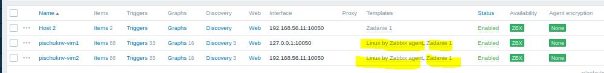

# Домашнее задание к занятию «Система мониторинга Zabbix 2»
Пищук Наталья Владимировна
### Задание 1
Создайте свой шаблон, в котором будут элементы данных, мониторящие загрузку CPU и RAM хоста.
Процесс выполнения
1. Выполняя ДЗ сверяйтесь с процессом отражённым в записи лекции.
2. В веб-интерфейсе Zabbix Servera в разделе Templates создайте новый шаблон
3. Создайте Item который будет собирать информацию об загрузке CPU в процентах
4. Создайте Item который будет собирать информацию об загрузке RAM в процентах
Требования к результату
 Прикрепите в файл README.md скриншот страницы шаблона с названием «Задание 1»

### Решение к заданию № 1
1. В веб-интерфейсе Zabbix Servera в разделе Templates создадим новый шаблон
Создадим новый шаблон:
1.1 Заходим в веб-интерфейс Zabbix Server.
1.2 Переходим в раздел Data collection → Templates.
1.3 Жмём на Create template).
1.4 В открывшейся форме заполните поля:
Template name: Укажим имя шаблона, «Template CPU and RAM Monitoring»
Groups: выберем группы, в которой будет сохранён шаблон (Templates).
Нажмём Add. (Группы: Templates, linux)
1.5 Добавляем макросы:

3. Создаем Item который будет собирать информацию об загрузке CPU в процентах
Поля для нового Item:
Name: укажем имя «CPU Load».
Type: выберем Zabbix agent.
Key: укажем ключ system.cpu.util[all]
Type of information: выберем Numeric (float).
Units: укажем %.
Update interval: укажем интервал обновления, например, 10s.

3. Создадим Item который будет собирать информацию об загрузке RAM в процентах
Поля для нового Item:
Name: укажем имя «RAM Usage»
Type: выберем Zabbix agent (или Zabbix agent (active)).
Key: укажем ключ vm.memory.size[<mode>].
Этот ключ возвращает загрузку оперативной памяти в процентах. Вместо <mode> зададим параметр: vm.memory.size[pused]
[pused] - параметр, указывающий на процент используемой памяти.
Type of information: выберем Numeric (float).
Units: укажем %.
Update interval: укажем интервал обновления, например, 10s.

По итогу в Data collection → Templates получим следующее:

4. Проверим и применим шаблон

6. Проверка данных
Перейдите в раздел Monitoring → Latest data.
Выберем хост, к которому привязан шаблон.

CPU

RAM

### Задание 2
Добавьте в Zabbix два хоста и задайте им имена <фамилия и инициалы-1> и <фамилия и инициалы-2>. Например: ivanovii-1 и ivanovii-2.
Процесс выполнения
1. Выполняя ДЗ сверяйтесь с процессом отражённым в записи лекции.
2. Установите Zabbix Agent на 2 виртмашины, одной из них может быть ваш Zabbix Server
3. Добавьте Zabbix Server в список разрешенных серверов ваших Zabbix Agentов
4. Добавьте Zabbix Agentов в раздел Configuration > Hosts вашего Zabbix Servera
5. Прикрепите за каждым хостом шаблон Linux by Zabbix Agent
6. Проверьте что в разделе Latest Data начали появляться данные с добавленных агентов
Требования к результату
Результат данного задания сдавайте вместе с заданием 3

### Решение к заданию № 2
Добавление агентов в Zabbix Server
1. Войдём в веб-интерфейс Zabbix.
2. Перейдём в раздел "Data collection → Hosts".
3. Далее "Create host".
4. Введём имя хоста (kaznacheevim-1 и аналогично kaznacheevim-2), выберем тип "Agent". Пропишем IP 10.0.2.16 и, а в настройках kaznacheevim-2 соответственно IP 10.0.2.16.
5. В секции "Templates" выберем шаблон "Linux by Zabbix Agent".

Проверка данных с агентов
1. Перейдём в раздел " Monitoring → Latest data".
2. Проверим, появляются ли данные с агентов kaznacheevim-1 и kaznacheevim-2.

### Задание 3
Привяжите созданный шаблон к двум хостам. Также привяжите к обоим хостам шаблон Linux by Zabbix Agent.
Процесс выполнения
1. Выполняя ДЗ сверяйтесь с процессом отражённым в записи лекции.
2. Зайдите в настройки каждого хоста и в разделе Templates прикрепите к этому хосту ваш шаблон
3. Так же к каждому хосту привяжите шаблон Linux by Zabbix Agent
4. Проверьте что в раздел Latest Data начали поступать необходимые данные из вашего шаблона
Требования к результату
Прикрепите в файл README.md скриншот страницы хостов, где будут видны привязки шаблонов с названиями «Задание 2-3». Хосты должны иметь зелёный статус подключения

### Решение к заданию № 3
Привязка шаблона к хостам
1. Войдём в веб-интерфейс нашего Zabbix Server.
2. Перейдём в раздел "Data collection → Hosts".
Добавление шаблона к хостам
1. Найдём созданные ранее хосты kaznacheevim-1 и kaznacheevim-2.
2. Кликним на имя каждого из хоста, чтобы открыть страницу его настроек.
3. В секции "Templates" нажмём "Select" для добавления шаблона.
4. Выберем шаблон, который мы создали (если он не автоматически появился в списке).

Проверка поступления данных
После привязки шаблонов, перейдём в раздел "Monitoring → Latest data".
Проверим, что для обоих хостов начинают появляться данные, относящиеся к нашему шаблону и к шаблону Linux by Zabbix Agent.

---

### Задание 4
Создайте свой кастомный дашборд.
Процесс выполнения
1. Выполняя ДЗ сверяйтесь с процессом отражённым в записи лекции.
2. В разделе Dashboards создайте новый дашборд
3. Разместите на нём несколько графиков на ваше усмотрение.
Требования к результату
Прикрепите в файл README.md скриншот дашборда с названием «Задание 4»

### Решение к заданию № 4
Создание нового дашборда
1. В веб-интерфейсе Zabbix, в верхнем меню выбираем "Dashboards".
2. Нажимаем на кнопку "Create new".

Вводим имя "dashboards_example" для нашего нового дашборда и нажмите "Add".
Добавление графиков на дашборд
На созданном дашборде, выберем "Graph" из списка элементов, которые можно добавить на дашборд.

---
